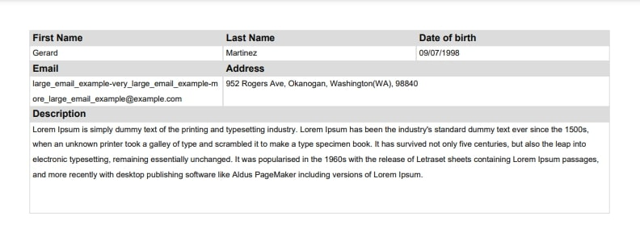

Usage
=====

.. _installation:

Installation
------------

To use fpdf-table, first install it from `PyPi <https://pypi.org/project/fpdf-table/>`_ using pip:

.. code-block:: console

   (.venv) $ pip install fpdf-table

Minimal Example
---------------

.. code-block:: python

   from fpdf_table import PDFTable
   from fpdf.enums import Align

    # initialize PDFTable
    pdf = PDFTable()
    # before doing anything, fpdf needs to create a page, define a font and set colors
    pdf.init()

    """
    table row
    """
    # draw a table header, pass a list with the text, by default width is the same for every column
    # and align is to left
    pdf.table_header(['First Name', 'Last Name', 'Date of birth'])
    # draw a table row, by default is only one row with height equal to pdf.default_cell_height
    pdf.table_row(['Gerard', 'Martinez', '09/07/1998'])

    """
    responsive row
    """
    # header with custom width
    pdf.table_header(['Email', 'Address'], [pdf.width_3(), 2 * pdf.width_3()])
    # responsive row with custom width
    pdf.table_row(['large_email_example-very_large_email_example-more_large_email_example@example.com',
                   '952 Rogers Ave, Okanogan, Washington(WA), 98840'],
                  [pdf.width_3(), 2 * pdf.width_3()], option='responsive')

    """
    fixed height row
    """
    # align center, expects a list of alignments but if you pass only one it spreads for every column
    pdf.table_header(['Description'], align=Align.C)
    large_text = """Lorem Ipsum is simply dummy text of the printing and typesetting......"""
    # fixed row needs fixed_height parameter
    pdf.table_row([large_text], option='fixed', fixed_height=6 * pdf.default_cell_height)
    # output
    pdf.output("tutorial_1.pdf")

Resulting PDF
^^^^^^^^^^^^^

