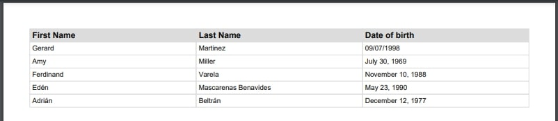
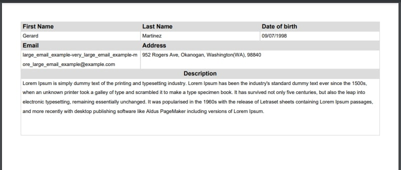

Usage
******

.. _installation:

Installation
=============

To use fpdf-table, first install it from `PyPi <https://pypi.org/project/fpdf-table/>`_ using pip:

.. code-block:: console

   (.venv) $ pip install fpdf-table

Minimal Example
===============
Code
----
.. literalinclude:: ../../examples/code/minimal_example.py
   :language: python

PDF
----

`minimal_example.pdf <https://github.com/matiasrebori/fpdf-table/blob/master/examples/pdfs/minimal_example.pdf>`_

Main Features
=============
Code
----
.. literalinclude:: ../../examples/code/features_example.py
   :language: python

PDF
----

`main_features.pdf <https://github.com/matiasrebori/fpdf-table/blob/master/examples/pdfs/main_features.pdf>`_

Usage in web APIs
==================
Please refer to `fpdf2 usage in web APIs <https://pyfpdf.github.io/fpdf2/UsageInWebAPI.html>`_